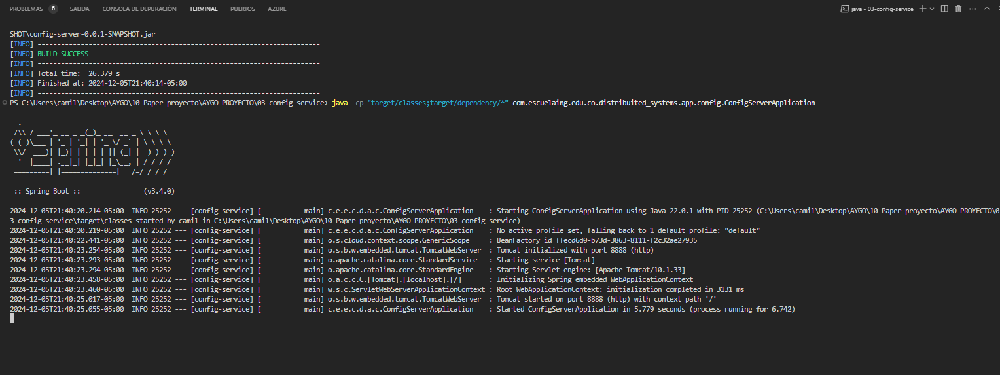
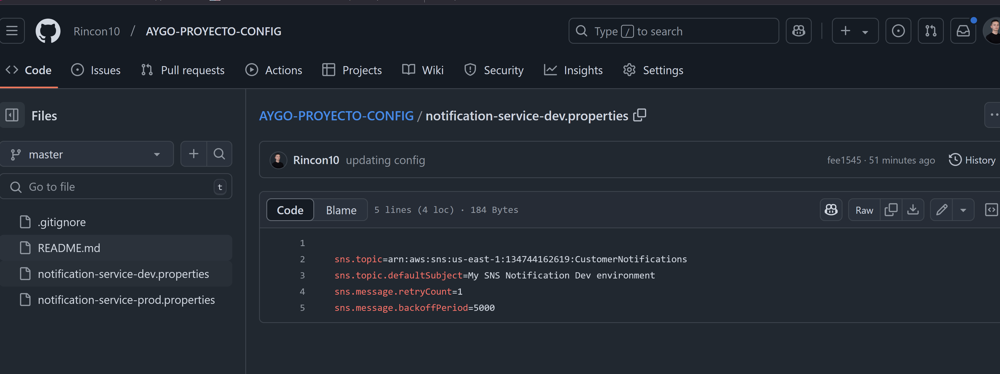
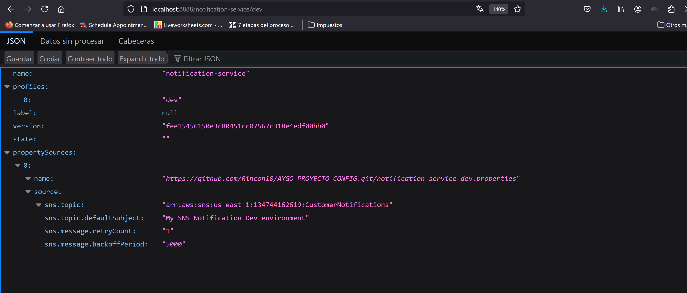

# Manual para Compilar y Ejecutar  Servicio Config
Este manual te guiará para compilar y ejecutar el **servicio Config** basado en **Spring Cloud Config** utilizando Maven.


## Paso 1: Clonar o Acceder al Proyecto

Si aún no tienes el proyecto en tu máquina, clónalo o navega al directorio del proyecto. Usa el siguiente comando para clonar desde un repositorio (reemplaza `<repository-url>` con la URL de tu repositorio):

```bash
git clone https://github.com/Rincon10/AYGO-PROYECTO.git
```

```bash
cd 03-config-service
```


## Paso 2: Compilar el Proyecto con Maven

n el directorio raíz del proyecto, ejecuta el siguiente comando

```bash
mvn clean install
```

### Paso 3: Comandos para ejecutar la aplicacion

>[!IMPORTANT]
Para que el proyecto se inicie correctamente sin ninguna excepción, es necesario tener un repositorio en el cual se encuentre la configuracion del servicio a utilizar. En nuestro caso nos baseremos en el siguiente [repositorio](https://github.com/Rincon10/AYGO-PROYECTO-CONFIG).

Para ejecutar el proyecto usa el siguiente comando:

### Windows


```bash
java -cp "target/classes;target/dependency/*" com.escuelaing.edu.co.distribuited_systems.app.config.ConfigServerApplication
```

### Linux

```bash
java -cp "target/classes:target/dependency/*" com.escuelaing.edu.co.distribuited_systems.app.config.ConfigServerApplication
```

si, todo ejecuta de manera correcta deberia ver el siguiente log



ademas de esto, si tratamos de consultar un archivo de configuracion de uno de los archivos .properties en el repo podriamos verlo en formato json

revisamos en el repo la siguiente .properties con nombre notification-service-dev.properties




ahora, si ejecutamos
```bash
http://localhost:8888/notification-service/dev
```

deberiamos ver la configuracion en formato json




## Manual de creacion de imagen docker

vamos a crear la imagen docker:
### Comandos Docker

```bash 
docker build --tag miusuario/service-config:1.0 .
```

```bash
docker build --tag rincon10/service-config:1.0 .
```


iniciando contenedor
```bash
docker run -d -p <puerto_host>:<puerto_contenedor> --name nombre_instancia <tu_usuario_docker>/<nombre_imagen>:<versión>
```

entonces ejecutamos

```bash
docker run -d -p 8888:8888 --name instancia1-config rincon10/service-config:1.0 
```


si todo sale bien veriamos que el contenedor se esta ejecutando de manera correcta

```bash
docker ps -a
```


### publicando la imagen

Para publicar la imagen en Docker Hub, sigue estos pasos:

```bash
docker login
```

y luego

```bash
docker push rincon10/service-config:1.0
```

### Configuracion en AWS

1. Acceda a la máquina virtual
2. Instale Docker

```bash
sudo yum update -y
sudo yum install docker
```
3. Inicie el servicio de docker

```bash
sudo service docker start
```
4. Configure su usuario en el grupo de docker para no tener que ingresar “sudo” cada vez que invoca un comando

```bash
sudo usermod -a -G docker ec2-user
```

5. Desconectese de la máquina virtual e ingrese nuevamente para que la configuración de grupos de usuarios tenga efecto.
6. A partir de la imagen creada en Dockerhub cree una instancia de un contenedor docker independiente de la consola (opción “-d”) y con el puerto 6000 enlazado a un puerto físico de su máquina (opción -p):


