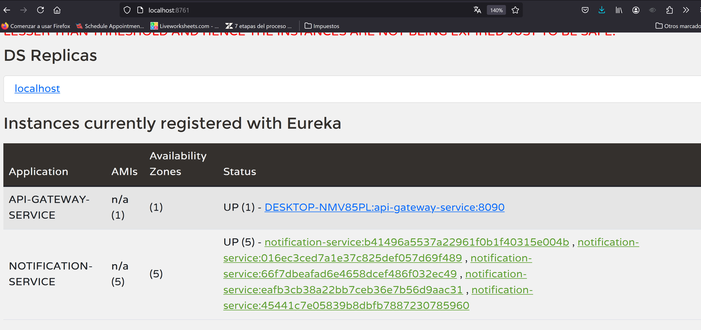

# Notification service

lo primero que haremos sera crear el topic en SNS de aws 

en nuestro caso lo llamamos Customer Notifications

para la integracion con nuestra aplicacion java, usaremos informacion que nos proporciona AWS

Ponemos a ejecutar nuestro servicio

y hacemos una peticion para validar su funcionamiento

ahora subiremos mas instancias del servicio, para validar su capacidad de escalabilidad

validamos en el discovery cuantas instancias tiene

