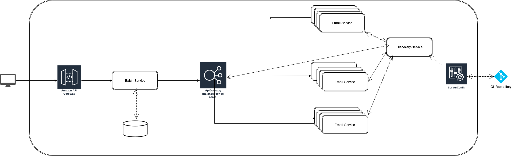

# MPV Proyecto envio notificaciones masivas JAVA
En este trabajo se busca analizar y proponer un sistema capaz de realizar la lectura, procesamiento y manipulación de datos masivos de manera eficiente, centrándonos en el contexto de notificación de facturas clientes, se busca orientar este trabajo a utilizar arquitecturas distribuidas actuales tales como microservicios, buscando así una escalabilidad del sistema al momento de procesar grandes cantidades de datos.

## Arquitectura propuesta 

### Backend Facade (Gateway)
- Una aplicación Spring Boot que actúa como la puerta de enlace API, desplegada en una instancia EC2 independiente.
- Este componente gestionará y dirigirá las solicitudes entrantes desde el cliente. Recibirá solicitudes POST del front-end, las validará y luego las enviará al servicio batch.

### Servicio Batch (Spring Batch)
- Una aplicación para procesamiento batch implementada en Java y desplegada utilizando Docker. Manejará la lógica de leer, procesar y enviar los datos que se encuentren en db para el servicio de notificacion.

- El batch  interactuará con una base de datos relacional para recuperar formas de contacto como correos a enviar.
- El batch procesara la data leida y la enviara la solicitud al servicio de notificaciones

### Servicio Notificaciones 
- Servicio especializado a recibir peticiones para envio de correos.

### Load Balancer (Spring Cloud Gateway)
- Balanceador de carga que se encargara de distribuir las peticiones enviadas por el batch al servicio de notificaciones, usando el algoritmo Round Robin

### Servicio Discovery (Spring Cloud Netflix)

- Actúa como un servicio de registro de servicios donde cada instancia de un servicio se registra para que otros servicios puedan encontrarla y se puedan comunicar de manera distribuida.

### Servicio configuracion (Spring Cloud Config)

- Servicio que almacena la configuracion de los servicios, funcionando como un middleware entre los microservicios y el repositorio, para obtener la configuracion.
- El repositorio el cual se basara su configuracion para el servicio de notificaciones sera [este]([https://github.com/Rincon10/AYGO-PROYECTO-CONFIG](https://github.com/Rincon10/01-NOTIFICACIONES-MASIVAS-SPRING-CLOUD-CONFIG))

## Desarrollo 

### Configuraciones y despliegues
A continuación se detalla la configuracion de los proyectos

1. [Configuración y ejecución servicio discovery](01-discovery-service/README.md)
2. [Configuración y ejecución servicio gateway](02-api-gateway-service/README.md)
3. [Configuración y ejecución servicio de configuracion](03-config-service/README.md)
4. [Configuración y ejecución servicio notificacion](04-notification-service/README.md)
5. [Configuración y ejecución servicio batch](05-batch-service/README.md)

### Video Funcionamiento Arquitectura propuesta

Video de funcionamiento de la arquitectura propuesta [aqui](https://www.youtube.com/watch?v=XnXMrjMVN4Q)
